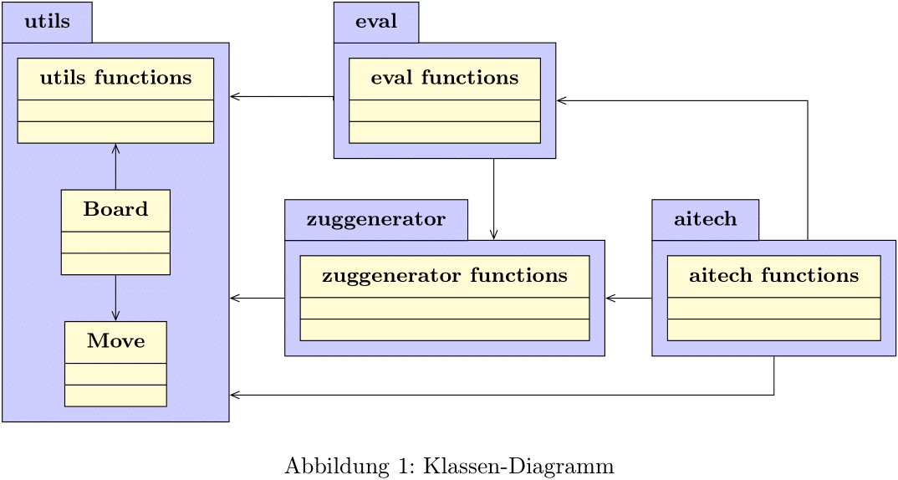

# King of the Hill Chess Engine

## Symbolic AI Project, Summer Semester 2023, Group O

This repository contains the codebase for a symbolic AI project developed as part of the module **"Projekt KI - symbolische Künstliche Intelligenz"** at **TU Berlin** in the **summer semester of 2023**.

The original project was developed collaboratively by a **group of three students** in the TU Berlin GitLab environment. This GitHub repository is a **personal portfolio copy** of that work.

### My contributions
My contributions included work on:
- move generation
- unit tests
- evaluation and move ordering
- PVS and dynamic time management

The project provides a competitive chess engine for the chess variant **King of the Hill**. During development, multiple combinations and variants of algorithms were explored. The repository includes versions of the following algorithms:
- Alpha-beta pruning
- PVS
- Monte Carlo Tree Search
- Minimax

It also provides a pure Python implementation of bitboards.

## Run

### Best move
To get the best move for a game position given as a FEN string, run:

<pre>
python path/to/ki_projekt_gruppe_o/main.py -fen your-fen-string -t 10
</pre>

Use the value after the `-t` flag to specify the time allocated for finding a move.  
Replace `your-fen-string` after the `-fen` flag with the FEN string of your game position.

The output will be a move in the form, for example, `a5b6`.

### Benchmarks
To run the AI benchmarks, use:

<pre>
python path/to/ki_projekt_gruppe_o/benchmark.py
</pre>

### Contests
To run the AI contests, use:

<pre>
python path/to/ki_projekt_gruppe_o/contests.py
</pre>

The output will be written to the `contest_results.dat` file.

## Object Diagram



## Project Structure

```text
ki_projekt_gruppe_o
├─── core/
│   ├─── aitech/
│   │   ├─── alpha_beta/ 
│   │   │   ├─── __init__.py
│   │   │   ├─── alpha_beta.py
│   │   │   ├─── alpha_beta_sorted.py
│   │   │   └─── alpha_beta_tt.py
│   │   ├─── pvs/
│   │   │   ├─── __init__.py
│   │   │   ├─── pvs.py
│   │   │   ├─── pvs_multi.py
│   │   │   ├─── pvs_sorted.py
│   │   │   ├─── pvs_sorted_multi.py
│   │   │   ├─── pvs_sorted_multi_qs.py
│   │   │   └─── pvs_sorted_qs.py
│   │   ├─── __init__.py
│   │   ├─── mcts.py
│   │   └─── minimax.py
│   ├─── __init__.py
│   ├─── dtm.py
│   ├─── eval.py
│   ├─── utils.py
│   └─── zuggenerator.py
├─── docs/
│   └─── croped.png
├─── benchmark.py
├─── contest_results.dat
├─── contests.py
├─── main.py
├─── README.md
└─── server-client.py